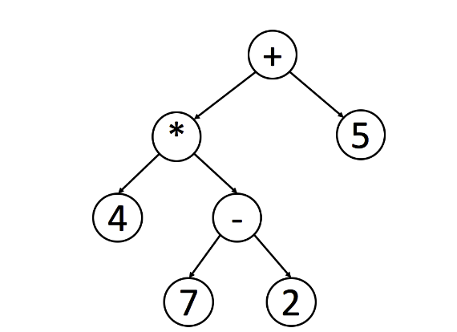

## Binary Tree

### Background
A tree is a frequently-used data structure to simulate a hierarchical tree structure.

### Traverse
- Pre-order: root -> left -> right
- In-order: left -> root -> right
  - for binary search tree: retrieve all the data in sorted order
- Post-order: left -> right -> root
  - when deleting node in a tree, deleting process will be post order
  - widely use in mathematical expression, to parse a post-order expression.
  