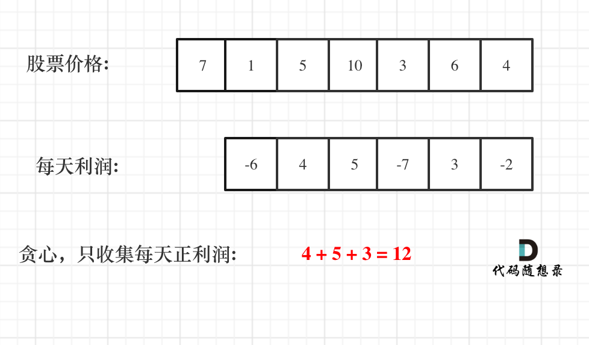

## 122. Best Time to Buy and Sell Stock II

### Solution: Single Pass
假如第0天买入，第3天卖出，那么利润为：prices[3] - prices[0]。
相当于(prices[3] - prices[2]) + (prices[2] - prices[1]) + (prices[1] - prices[0])。
利润平均到每天，想象每天都可以买入再卖出。我们只要考虑每天有正向利润的作为收入，然后把他们求和就可以了。
  

```Python
class Solution:
    def maxProfit(self, prices: List[int]) -> int:
        max_profit = 0
        for i in range(1, len(prices)):
            gap = prices[i] - prices[i-1]
            if gap > 0:
                max_profit += gap
        return max_profit
```