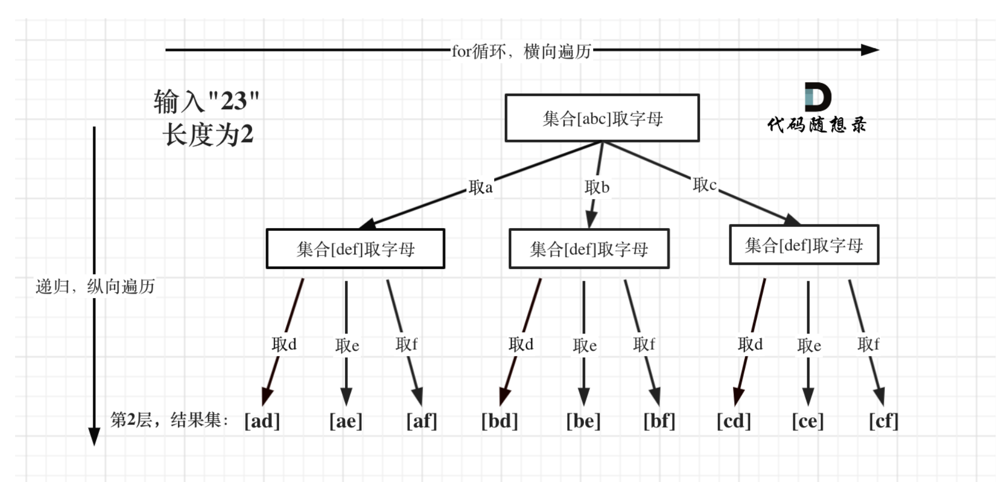

## TODO
- 28. Find the Index of the First Occurrence in a String -> hard to remember KMP
- 31. Next Permutation: there is no data structure but a trick algorithm
- 34. Find First and Last Position of Element in Sorted Array. Not very familiar. 
- 37. Sudoku Solver
- 39. 40 Backtracking, skipping


### Dynamic Programming
#### [1] 509. Fibonacci Number
- Difficulty: Easy - 2min
Thoughts:
- `dp[i] = dp[i - 1] + dp[i - 2]`

#### [2] 70. Climbing Stairs
- Difficulty: Easy - 10min
Thoughts:
- `dp[i] = dp[i - 1] + dp[i - 2]`

#### [3]] 746. Min Cost Climbing Stairs
- Difficulty: Easy - 15min
Thoughts:
- `dp[i] = min(cost[i-1] + dp[i-1], cost[i-2] + dp[i-2])`

#### [4]] 1. Two Sum
- Difficulty: Easy - 5min

#### [5]] 5. Longest Palindromic Substring (Hard)
- Difficulty: **Hard**
Thoughts:
- Palindromic String: two pointers
- Longest:
  - DP
  - **two pointers (preferred)**
    - iterate through the string
    - assume every one/two letter as center and expand it in two ways
  
#### [6] 15. Three Sum
- Difficulty: **Medium**
Thoughts:
1. sort array `nums.sort()` (in place sort)
2. two for loop
   - deduplicate first iteration `if i >= 1 and nums[i] == nums[i - 1]:`
   - if overall sum of three numbers is bigger than 0 -> `right -= 1`. Else -> `left += 1`
   - deduplicate right or left when sum == 0

Optimization:
1. prune: if the value in first iteration is > 0 -> break

Complexity:
- Time: O(N^2)
- Space: O(N)

#### [7] 17. Letter Combinations of a Phone Number
- Difficulty: **Hard**
- Thoughts (Backtrack):
  1. Each recursion we go in depth
  2. Each for loop we go horizontal
  3. We revert the change after every iteration going in depth

  

#### [8] 18. 4 Sum
Difficulty: **Medium**
Thoughts: another for loop adding to 3 sum
Complexity: 
- Time: O(N ^ 3)
- Space:  O(N)

#### [9] 19. Remove Nth Node From the End of the List
Difficulty: **Medium**
Thoughts (two pointer)
- fast and slow pointer, fast = slow + N
- make a dummy node in case after removal the list is empty and the case where we need to remove the first node
- always record the prev node since we need that to remove node

#### [10] 20. Valid Parentheses
Difficulty: **Easy**
Thoughts (stack)
- Every time we meet a `( { [` we append `) } ]`
- Every time we meet `) } ]` we check if the stack is empty, if it is not empty if the top element is the current element
- if after the for loop, we eventually get an empty stack, then it is valid

Complexity: 
- Time: O(N)
- Space: O(N)

#### [11] 24. Swap Nodes in Pairs
Difficulty: **Easy**
Thoughts:
- make a dummy node
- record prev, cur, cur.next, cur.next.next
- switch pointers of these nodes
- when cur node doesn't have next, break. This is the case where there a single node not in pairs in the end of the list


Complexity: 
- Time: O(N)
- Space: O(1)

#### [12] 27. Remove Elements
Difficulty: **Easy**
Thoughts (two pointer)
- one pointer will iterate through the array in a for loop
- another pointer only move when the current value is not target value and every time we assign the value in pointer one to pointer two.

#### [13] 28. Find the Index of the First Occurrence in a String
Difficulty: **Hard**
Thoughts (KMP, but I don't remember it :()

An easy but not KMP solution
```Python
    for i in range(0, len(haystack) - len(needle) + 1):
        if haystack[i:i+len(needle)] == needle:
            return i
    
    return -1
```

#### [14] 31. Next Permutation
Difficulty: **Hard**
BrainStorm
- given [1, 2, 3, 4]
- all permutation will be 
  [1, 2, 3, 4], [1, 2, 4, 3], [1, 3, 2, 4], [1, 3, 4, 2], [1, 4, 2, 3], [1, 4, 3, 2], [2, 1, 3, 4]

#### [15] 34. Find First and Last Position of Element in Sorted Array
Difficulty: **Hard**
Thoughts (Binary Search):
- binary search for right border
- binary search for left border
- get range with left and right

#### [16] 35. Search Insert Position
Difficulty: **Medium**
Thoughts: binary search

#### [17] 37. Sudoku Solver
Difficulty: **Very Hard**
Thoughts: back track

#### [18] 344. Reverse String
Difficulty: **Easy**
Thoughts: two pointer, one from beginning one from the end

#### [19] 703. Kth Largest Element in a Stream
Difficulty: **Medium**
Thoughts: Only keep Kth largest elements in the heap
1. Create a min heap
2. Pop element until the size of heap is K
3. Every time we inserted a new val, we insert and then pop

#### [20] 200. Number of Islands
Difficulty: **Medium**
Thoughts:
- DFS (Recursive)
- Mark visited node as 0 to avoid revisit and infinite loop. 
- careful about edge cases