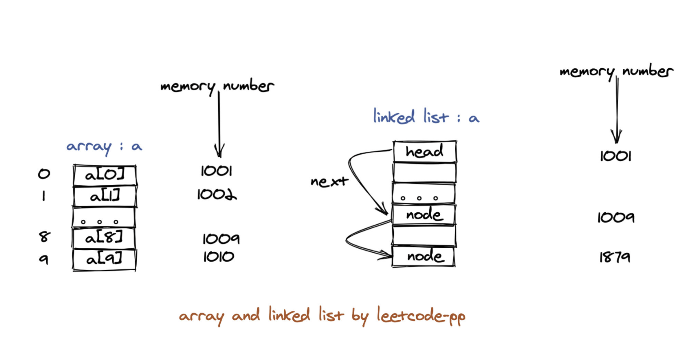
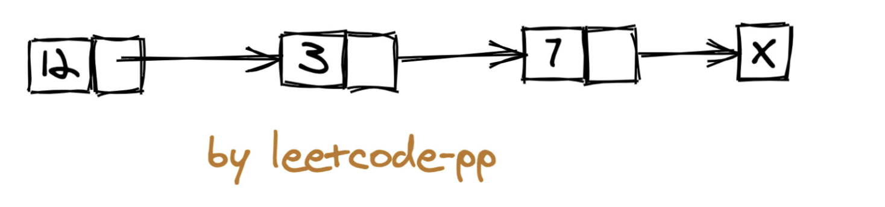

## Overview

### Array vs Linked List
- Array: consecutive memory, can be accessed
  - Insert, Delete: O(N) for head and middle
  - Easy to query
- Linked List: linked by pointer(next pointer)
  - non-continuous, non-sequential data storage structure
  - Use case: need order, need frequent deletion or insertion. 




```java
interface ListNode<T> {
    data: T; // the actual data
    next: ListNode<T>; // point to the next node
}
```


## Basic Operations

### Insertion

if the insert position is specified, Time Complexity: O(1).
else: O(N)

```
temp = 待插入位置的前驱节点.next
待插入位置的前驱节点.next = 待插入指针
待插入指针.next = temp
```

### Deletion
只需要将需要删除的节点的前驱指针的 next 指针修正为其下下个节点即可，注意考虑边界条件。
```
待删除位置的前驱节点.next = 待删除位置的前驱节点.next.next
```

### Traverse

iterative solution
```当前指针 =  头指针
while 当前节点不为空 {
   print(当前节点)
   当前指针 = 当前指针.next
}
```

recursion solution
```
dfs(cur) {
    if 当前节点为空 return
    print(cur.val)
    return dfs(cur.next)
}
```

### Tricks & Patterns
- 链表是一种递归的数据结构，因此采用递归的思想去考虑往往事半功倍


### Solutions
Recursion Solution
```Python
class Solution:
    def reverseList(self, head: ListNode) -> ListNode:
        
        def _reverse(cur, pre):
            if cur is None:
                return pre
            temp = cur.next
            cur.next = pre
            return _reverse(temp, cur) # the reason why we need to return because we want to return the result through all the recursive functions all the way back to the root function
            
        return _reverse(head, None)
```

Iterative Solution
```Java
class Solution {
    public ListNode reverseList(ListNode head) {
        ListNode pre = null;
        ListNode cur = head; // this is not necessary, could be replaced by head
        ListNode temp;
        while(cur != null) {
            temp = cur.next;
            cur.next = pre;
            pre = cur;
            cur = temp;
        }
        return pre;
    }
}
```